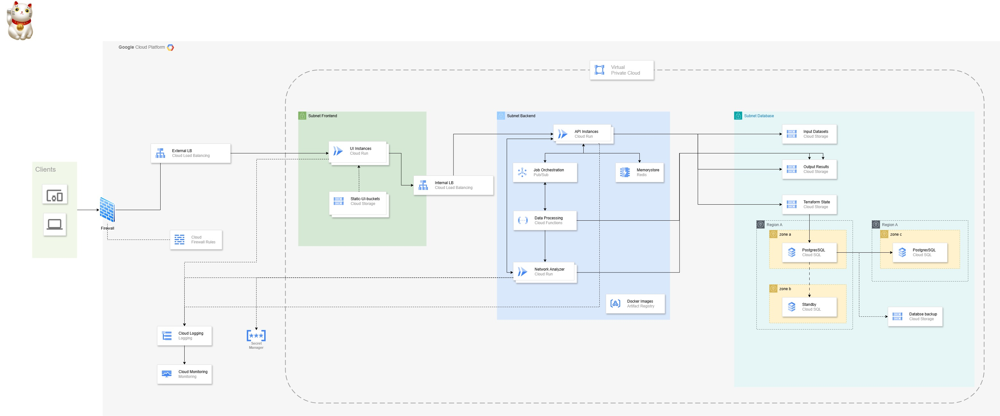

# AutonetGen - Terraform & Docker Infrastructure Guide



## 📋 Indice
- [AutonetGen - Terraform \& Docker Infrastructure Guide](#autonetgen---terraform--docker-infrastructure-guide)
  - [📋 Indice](#-indice)
  - [Panoramica del Progetto](#panoramica-del-progetto)
  - [Architettura dell'Infrastruttura](#architettura-dellinfrastruttura)
  - [Struttura del Progetto](#struttura-del-progetto)
  - [Prerequisiti](#prerequisiti)
  - [Guida all'Installazione](#guida-allinstallazione)
    - [Fase 1: Preparare l'Ambiente](#fase-1-preparare-lambiente)
    - [Fase 2: Configurare le Immagini Docker](#fase-2-configurare-le-immagini-docker)
    - [Fase 3: Costruire e Pubblicare le Immagini](#fase-3-costruire-e-pubblicare-le-immagini)
    - [Fase 4: Configurare Terraform](#fase-4-configurare-terraform)
    - [Fase 5: Deployare l'Infrastruttura](#fase-5-deployare-linfrastruttura)
  - [Codice Terraform in Dettaglio](#codice-terraform-in-dettaglio)
    - [File Principali Terraform](#file-principali-terraform)
      - [1. main.tf](#1-maintf)
      - [2. variables.tf](#2-variablestf)
      - [3. outputs.tf](#3-outputstf)
      - [4. providers.tf](#4-providerstf)
    - [Moduli Terraform](#moduli-terraform)
      - [1. Modulo Networking (modules/networking/)](#1-modulo-networking-modulesnetworking)
      - [2. Modulo Frontend (modules/frontend/)](#2-modulo-frontend-modulesfrontend)
      - [3. Modulo Backend (modules/backend/)](#3-modulo-backend-modulesbackend)
      - [4. Modulo Database (modules/database/)](#4-modulo-database-modulesdatabase)
      - [5. Modulo Monitoring (modules/monitoring/)](#5-modulo-monitoring-modulesmonitoring)
  - [Immagini Docker in Dettaglio](#immagini-docker-in-dettaglio)
    - [Frontend (network-analyzer-gui)](#frontend-network-analyzer-gui)
    - [Backend API](#backend-api)
    - [Network Analyzer](#network-analyzer)
    - [Ruolo e interazione degli script di avvio](#ruolo-e-interazione-degli-script-di-avvio)
  - [Personalizzazione](#personalizzazione)
    - [Variabili Terraform](#variabili-terraform)
    - [Configurazione del Database](#configurazione-del-database)
    - [Configurazione del Monitoraggio](#configurazione-del-monitoraggio)
  - [Operazioni Post-Deployment](#operazioni-post-deployment)
  - [Risoluzione Problemi](#risoluzione-problemi)
    - [Problemi Docker](#problemi-docker)
    - [Problemi Terraform](#problemi-terraform)
    - [Problemi Runtime](#problemi-runtime)
  - [Best Practices per la Produzione](#best-practices-per-la-produzione)

## Panoramica del Progetto

AutonetGen è un sistema avanzato per l'analisi di dataset di traffico di rete (PCAP, CSV, NetFlow) che esegue le seguenti operazioni:
- Identifica host IP e assegna ruoli (client, server, PLC, ecc.)
- Rileva protocolli utilizzati nella rete
- Mappa servizi e porte
- Riconosce pattern di comunicazione
- Genera configurazioni Terraform per implementare l'infrastruttura rilevata su GCP

Questo progetto fornisce un'implementazione completa basata su container e pronta per il cloud che include:
- Interfaccia utente React per interazioni e visualizzazioni
- Backend API Python per l'elaborazione e l'orchestrazione
- Engine di analisi di rete ad alte prestazioni
- Infrastruttura Terraform completa per il deployment su Google Cloud Platform

## Architettura dell'Infrastruttura

L'architettura implementa il diagramma di progetto e include:

1. **Networking Layer**:
   - VPC personalizzata con subnet separate (frontend, backend, database)
   - Firewall rules per comunicazione sicura
   - Load balancer esterno per il frontend
   - Load balancer interno per i servizi backend

2. **Frontend Layer**:
   - Servizio Cloud Run per l'interfaccia utente React
   - Storage per contenuti statici con CDN
   - Connettività VPC sicura

3. **Backend Layer**:
   - Servizi Cloud Run per API e analisi
   - Redis Memorystore per caching
   - Job orchestration per elaborazioni in background

4. **Database Layer**:
   - Istanze PostgreSQL Cloud SQL
   - Replica multi-zona e multi-regione
   - Backup automatizzato

5. **Monitoring Layer**:
   - Dashboard personalizzata
   - Alerting configurabile
   - Logging centralizzato

## Struttura del Progetto

```
autonetgen/
├── terraform/                      # Codice Terraform
│   ├── main.tf                     # File principale Terraform
│   ├── variables.tf                # Definizione variabili
│   ├── outputs.tf                  # Output dell'infrastruttura
│   ├── providers.tf                # Configurazione provider GCP
│   ├── terraform.tfvars            # Valori delle variabili
│   └── modules/                    # Moduli dell'infrastruttura
│       ├── networking/             # VPC, subnet, firewall
│       ├── frontend/               # Servizi frontend
│       ├── backend/                # Servizi backend
│       ├── database/               # PostgreSQL e replica
│       └── monitoring/             # Logging e alerting
│
├── network-analyzer-gui/           # Frontend React
│   ├── Dockerfile                  # Dockerfile per frontend
│   ├── nginx/                      # Configurazione NGINX
│   │   ├── nginx.conf              # File di configurazione NGINX
│   │   └── docker-entrypoint.sh    # Script di inizializzazione
│   └── ...                         # Codice sorgente React
│
├── backend/                        # Backend Python
│   ├── api.py                      # API principale
│   ├── analyzer_api.py             # API per l'analizzatore
│   ├── setup.py                    # File di configurazione Python
│   ├── startup.sh                  # Script di avvio backend
│   ├── analyzer_startup.sh         # Script di avvio analizzatore
│   ├── health_check.py             # Controlli di salute
│   ├── terraform_manager.py        # Gestione Terraform via API
│   └── ...                         # Altri moduli Python
│
├── Dockerfile.backend              # Dockerfile per Backend API
├── Dockerfile.analyzer             # Dockerfile per Network Analyzer
└── build-and-deploy.sh             # Script di build e deployment
```

## Prerequisiti

Prima di iniziare, assicurati di avere:

- Account Google Cloud Platform con fatturazione abilitata
- Progetto GCP creato
- [Google Cloud SDK](https://cloud.google.com/sdk/docs/install) installato e configurato
- [Docker](https://docs.docker.com/get-docker/) installato
- [Terraform](https://developer.hashicorp.com/terraform/downloads) v1.0+ installato
- [Git](https://git-scm.com/downloads) installato

## Guida all'Installazione

### Fase 1: Preparare l'Ambiente

1. **Clona il repository**:
   ```bash
   git clone https://github.com/vincenzo426/autonetgen.git
   cd autonetgen
   ```

2. **Imposta il progetto GCP**:
   ```bash
   gcloud config set project YOUR_PROJECT_ID
   ```

3. **Abilita le API necessarie**:
   ```bash
   gcloud services enable compute.googleapis.com \
     artifactregistry.googleapis.com \
     containerregistry.googleapis.com \
     cloudbuild.googleapis.com \
     run.googleapis.com \
     secretmanager.googleapis.com \
     sqladmin.googleapis.com \
     redis.googleapis.com \
     monitoring.googleapis.com
   ```

4. **Crea le directory per i Dockerfile**:
   ```bash
   mkdir -p network-analyzer-gui/nginx
   ```

### Fase 2: Configurare le Immagini Docker

1. **Posiziona i Dockerfile nei percorsi corretti**:
   - Crea il file `network-analyzer-gui/Dockerfile` (Dockerfile per il frontend)
   - Crea il file `Dockerfile.backend` nella root del progetto
   - Crea il file `Dockerfile.analyzer` nella root del progetto

2. **Crea le directory per i file di supporto**:
   ```bash
   mkdir -p network-analyzer-gui/nginx
   mkdir -p backend
   ```

3. **Posiziona i file di configurazione NGINX**:
   - Crea il file `network-analyzer-gui/nginx/nginx.conf`
   - Crea il file `network-analyzer-gui/nginx/docker-entrypoint.sh`

4. **Posiziona gli script di avvio**:
   - Crea il file `backend/startup.sh`
   - Crea il file `backend/analyzer_startup.sh`
   - Crea il file `backend/health_check.py`
   - Crea il file `backend/analyzer_api.py`

5. **Assicurati che gli script siano eseguibili**:
   ```bash
   chmod +x network-analyzer-gui/nginx/docker-entrypoint.sh
   chmod +x backend/startup.sh
   chmod +x backend/analyzer_startup.sh
   chmod +x build-and-deploy.sh
   ```

### Fase 3: Costruire e Pubblicare le Immagini

Puoi utilizzare lo script di automazione fornito:

```bash
./build-and-deploy.sh
```

Oppure eseguire i passaggi manualmente:

1. **Configura le variabili**:
   ```bash
   PROJECT_ID=$(gcloud config get-value project)
   REGION="us-central1"
   ```

2. **Crea un repository Artifact Registry**:
   ```bash
   gcloud artifacts repositories create autonetgen \
     --repository-format=docker \
     --location=$REGION \
     --description="AutonetGen Docker Repository"
   ```

3. **Configura l'autenticazione Docker**:
   ```bash
   gcloud auth configure-docker $REGION-docker.pkg.dev
   ```

4. **Costruisci e pubblica le immagini**:
   ```bash
   # Frontend
   cd network-analyzer-gui
   docker build -t $REGION-docker.pkg.dev/$PROJECT_ID/autonetgen/frontend:latest .
   docker push $REGION-docker.pkg.dev/$PROJECT_ID/autonetgen/frontend:latest
   cd ..

   # Backend
   docker build -f Dockerfile.backend -t $REGION-docker.pkg.dev/$PROJECT_ID/autonetgen/backend:latest .
   docker push $REGION-docker.pkg.dev/$PROJECT_ID/autonetgen/backend:latest

   # Analyzer
   docker build -f Dockerfile.analyzer -t $REGION-docker.pkg.dev/$PROJECT_ID/autonetgen/network-analyzer:latest .
   docker push $REGION-docker.pkg.dev/$PROJECT_ID/autonetgen/network-analyzer:latest
   ```

### Fase 4: Configurare Terraform

1. **Personalizza le variabili Terraform**:
   
   Modifica il file `terraform/terraform.tfvars`:

   ```hcl
   project_id = "your-project-id"
   region     = "us-central1"
   zones      = ["us-central1-a", "us-central1-b", "us-central1-c"]

   secondary_region = "us-west1"
   secondary_zones  = ["us-west1-a", "us-west1-b"]

   frontend_service_name = "autonetgen-frontend"
   frontend_container_image = "us-central1-docker.pkg.dev/your-project-id/autonetgen/frontend:latest"

   backend_service_name = "autonetgen-backend"
   backend_container_image = "us-central1-docker.pkg.dev/your-project-id/autonetgen/backend:latest"
   ```

2. **Configura la password del database** (opzione 1 - via Secret Manager):
   ```bash
   echo -n "StrongDatabasePassword123!" | gcloud secrets create db-password --data-file=-
   ```

   Poi nel file `terraform.tfvars` aggiungi il nome del secret (non il valore):
   ```hcl
   db_password_secret = "db-password"
   ```

   Oppure (opzione 2 - solo per ambienti dev):
   ```hcl
   db_password = "StrongDatabasePassword123!"
   ```

### Fase 5: Deployare l'Infrastruttura

1. **Inizializza Terraform**:
   ```bash
   cd terraform
   terraform init
   ```

2. **Valida la configurazione**:
   ```bash
   terraform validate
   ```

3. **Visualizza il piano di esecuzione**:
   ```bash
   terraform plan
   ```

4. **Applica la configurazione**:
   ```bash
   terraform apply
   ```

5. **Verifica gli output**:
   ```bash
   terraform output
   ```

## Codice Terraform in Dettaglio

### File Principali Terraform

#### 1. main.tf

**Funzione**: File principale che orchestra tutti i moduli dell'infrastruttura.

**Contenuto principale**:
- Dichiarazione di tutti i moduli (networking, frontend, backend, database, monitoring)
- Definizione delle dipendenze tra moduli tramite `depends_on`
- Passaggio di valori di input ai moduli

**Esempio di dichiarazione modulo**:
```hcl
module "frontend" {
  source = "./modules/frontend"

  project_id            = var.project_id
  region                = var.region
  network_id            = module.networking.network_id
  frontend_subnet_id    = module.networking.subnet_ids["frontend"]
  service_name          = var.frontend_service_name
  container_image       = var.frontend_container_image
  backend_service_url   = module.backend.backend_service_url
  depends_on            = [module.networking, module.backend]
}
```

#### 2. variables.tf

**Funzione**: Definisce tutte le variabili di input per l'infrastruttura.

**Categorie di variabili**:
- Variabili di progetto (project_id, region)
- Variabili di rete (network_name, subnet_cidr_ranges)
- Variabili di servizio (nomi servizi, immagini container)
- Variabili di database (tier, credenziali)
- Variabili di monitoraggio (retention, configurazioni alert)

#### 3. outputs.tf

**Funzione**: Definisce gli output dopo il deployment dell'infrastruttura.

**Output principali**:
- URL dei servizi frontend e backend
- Informazioni di connessione al database
- Indirizzi IP dei load balancer
- URL della dashboard di monitoraggio

#### 4. providers.tf

**Funzione**: Configura i provider Terraform (principalmente Google Cloud).

**Contenuto**:
- Versioni dei provider richieste
- Configurazione del provider Google Cloud
- Opzionalmente configurazione backend remoto per lo stato Terraform

### Moduli Terraform

#### 1. Modulo Networking (modules/networking/)

**Funzione**: Crea l'infrastruttura di rete su GCP.

**File principali**:
- `main.tf`: Definisce VPC, subnet, firewall, NAT e load balancer
- `outputs.tf`: Espone ID e URL delle risorse di rete
- `variables.tf`: Definisce variabili specifiche per il networking

**Risorse principali**:
- `google_compute_network`: VPC principale
- `google_compute_subnetwork`: Subnet per frontend, backend e database
- `google_compute_firewall`: Regole per traffico interno ed esterno
- `google_compute_router` e `google_compute_router_nat`: NAT per accesso Internet
- `google_compute_global_address`: IP per load balancer esterno
- `google_compute_url_map` e `google_compute_backend_service`: Configurazione load balancer

#### 2. Modulo Frontend (modules/frontend/)

**Funzione**: Gestisce i servizi e le risorse per il frontend.

**File principali**:
- `main.tf`: Crea servizio Cloud Run, bucket, CDN e connettività
- `outputs.tf`: Espone URL e riferimenti delle risorse frontend
- `variables.tf`: Variabili specifiche per il frontend

**Risorse principali**:
- `google_storage_bucket`: Storage per contenuti statici
- `google_service_account`: Account di servizio per Cloud Run
- `google_cloud_run_service`: Servizio per UI React
- `google_vpc_access_connector`: Connettore VPC per Cloud Run
- `google_compute_region_network_endpoint_group`: NEG per integrazione load balancer
- `google_compute_backend_bucket`: Configurazione CDN per contenuti statici

#### 3. Modulo Backend (modules/backend/)

**Funzione**: Gestisce i servizi e le risorse per il backend e l'analizzatore.

**File principali**:
- `main.tf`: Crea servizi Cloud Run, storage, secrets e Redis
- `outputs.tf`: Espone URL API e riferimenti delle risorse
- `variables.tf`: Variabili specifiche per il backend

**Risorse principali**:
- `google_storage_bucket`: Storage per dati dei job
- `google_service_account`: Account per backend e job
- `google_secret_manager_secret`: Gestione credenziali del database
- `google_cloud_run_service`: Servizi per API e analizzatore
- `google_cloud_scheduler_job`: Scheduler per job periodici
- `google_redis_instance`: Cache Redis

#### 4. Modulo Database (modules/database/)

**Funzione**: Gestisce le istanze PostgreSQL e la replica.

**File principali**:
- `main.tf`: Crea istanze Cloud SQL, configurazioni e backup
- `outputs.tf`: Espone informazioni di connessione al database
- `variables.tf`: Variabili specifiche per il database

**Risorse principali**:
- `google_sql_database_instance`: Istanza primaria e di replica
- `google_sql_database`: Database PostgreSQL
- `google_sql_user`: Utente database
- `google_storage_bucket`: Storage per backup

#### 5. Modulo Monitoring (modules/monitoring/)

**Funzione**: Gestisce logging, allarmi e dashboard.

**File principali**:
- `main.tf`: Crea bucket logs, configurazioni allarmi e dashboard
- `outputs.tf`: Espone URL dashboard e riferimenti monitoraggio
- `variables.tf`: Variabili specifiche per il monitoraggio

**Risorse principali**:
- `google_storage_bucket`: Archiviazione centralizzata log
- `google_logging_project_sink`: Esportazione log
- `google_monitoring_alert_policy`: Configurazione allarmi
- `google_monitoring_notification_channel`: Canali notifica
- `google_monitoring_dashboard`: Dashboard personalizzata

## Immagini Docker in Dettaglio

### Frontend (network-analyzer-gui)

**Descrizione**: Serve l'interfaccia utente React tramite NGINX, configurata per funzionare su Cloud Run.

**Posizione del Dockerfile e file correlati**:
- **`network-analyzer-gui/Dockerfile`**: Deve essere posizionato nella directory del frontend
- **`network-analyzer-gui/nginx/nginx.conf`**: Configurazione NGINX
- **`network-analyzer-gui/nginx/docker-entrypoint.sh`**: Script per sostituire variabili a runtime

**Dockerfile in dettaglio**:
```dockerfile
# Fase di build
FROM node:18 AS build
WORKDIR /app
COPY package.json package-lock.json ./
RUN npm ci
COPY . .
ARG REACT_APP_API_URL=https://autonetgen-backend-SERVICE_HASH-uc.a.run.app
ENV REACT_APP_API_URL=$REACT_APP_API_URL
RUN npm run build

# Fase di produzione
FROM nginx:alpine
COPY --from=build /app/build /usr/share/nginx/html
COPY nginx/nginx.conf /etc/nginx/conf.d/default.conf
COPY nginx/docker-entrypoint.sh /usr/local/bin/
RUN chmod +x /usr/local/bin/docker-entrypoint.sh
EXPOSE 8080
RUN mkdir -p /usr/share/nginx/html/health && \
    echo "OK" > /usr/share/nginx/html/health/index.html
ENTRYPOINT ["/usr/local/bin/docker-entrypoint.sh"]
CMD ["nginx", "-g", "daemon off;"]
```

**File chiave**:
- `network-analyzer-gui/Dockerfile`: Multi-stage build per ottimizzare le dimensioni
- `network-analyzer-gui/nginx/nginx.conf`: Configurazione del server web
- `network-analyzer-gui/nginx/docker-entrypoint.sh`: Script per sostituire variabili a runtime

**Script docker-entrypoint.sh**:
```bash
#!/bin/sh
# Sostituisce le variabili d'ambiente nella configurazione di nginx
envsubst '${BACKEND_API_URL}' < /etc/nginx/conf.d/default.conf > /etc/nginx/conf.d/default.conf.tmp
mv /etc/nginx/conf.d/default.conf.tmp /etc/nginx/conf.d/default.conf
# Continua con il comando specificato
exec "$@"
```

**Configurazione NGINX (nginx.conf)**:
```nginx
server {
    listen 8080;
    root /usr/share/nginx/html;
    index index.html;

    # Configurazione gzip per migliorare le performance
    gzip on;
    gzip_vary on;
    gzip_min_length 10240;
    gzip_proxied expired no-cache no-store private auth;
    gzip_types text/plain text/css text/xml text/javascript application/x-javascript application/xml application/javascript;
    gzip_disable "MSIE [1-6]\.";

    # Health check per Cloud Run e Load Balancer
    location /health {
        access_log off;
        add_header Content-Type text/plain;
        return 200 'OK';
    }

    # Configurazione SPA
    location / {
        try_files $uri $uri/ /index.html;
        add_header Cache-Control "no-cache, no-store, must-revalidate";
    }

    # Cache statica per file che cambiano raramente
    location ~* \.(js|css|png|jpg|jpeg|gif|ico|svg)$ {
        expires 1y;
        add_header Cache-Control "public, max-age=31536000";
    }

    # Redirezione per API a backend
    location /api/ {
        # BACKEND_API_URL sarà sostituito in runtime
        proxy_pass ${BACKEND_API_URL};
        proxy_http_version 1.1;
        proxy_set_header Upgrade $http_upgrade;
        proxy_set_header Connection 'upgrade';
        proxy_set_header Host $host;
        proxy_cache_bypass $http_upgrade;
    }
}
```

**Funzionamento**:
1. Compila l'applicazione React in un ambiente Node.js
2. Il risultato della compilazione viene copiato in un'immagine NGINX più leggera
3. Lo script docker-entrypoint.sh sostituisce variabili d'ambiente nella configurazione NGINX
4. NGINX serve l'applicazione frontend e inoltra le richieste API al backend
5. La configurazione include ottimizzazioni per prestazioni (gzip, cache) e health check

**Variabili d'ambiente chiave**:
- `BACKEND_API_URL`: URL del servizio backend per le richieste API
- `REACT_APP_API_URL`: URL API utilizzato durante la compilazione di React

**Personalizzazione**:
- Modifica `Dockerfile` per cambiare la versione di Node.js o NGINX
- Aggiusta `nginx.conf` per modificare comportamenti di caching o routing
- Aggiorna variabili d'ambiente nel file terraform per backend API URL

### Backend API

**Descrizione**: Gestisce le richieste API, l'orchestrazione dei job e la comunicazione con il database.

**Posizione del Dockerfile**:
- **`Dockerfile.backend`**: Deve essere posizionato nella directory principale (root) del progetto

**Dockerfile in dettaglio**:
```dockerfile
FROM python:3.9-slim

WORKDIR /app

# Installa dipendenze di sistema necessarie
RUN apt-get update && apt-get install -y --no-install-recommends \
    gcc \
    libpq-dev \
    python3-dev \
    && apt-get clean \
    && rm -rf /var/lib/apt/lists/*

# Copia file di requisiti
COPY backend/setup.py requirements.txt ./

# Aggiunge dipendenze API per Flask
RUN echo "flask==2.2.3\nflask-cors==3.0.10\ngunicorn==20.1.0\npsycopg2-binary==2.9.5\nredis==4.5.1\ngoogle-cloud-secret-manager==2.12.6\ngoogle-cloud-storage==2.7.0" >> requirements.txt

# Installa dipendenze
RUN pip install --no-cache-dir -r requirements.txt
RUN pip install -e .

# Copia il codice del backend
COPY backend ./backend/
COPY backend/api.py .

# Crea directory per i dati temporanei
RUN mkdir -p /tmp/uploads

# Espone la porta utilizzata da gunicorn
EXPOSE 8080

# Configurazione delle variabili d'ambiente
ENV PYTHONUNBUFFERED=1 \
    PORT=8080 \
    DEFAULT_OUTPUT_DIR=/tmp/output

# Script di avvio del servizio
COPY backend/startup.sh ./
RUN chmod +x ./startup.sh

# Endpoint di health check
COPY backend/health_check.py ./

# Avvia l'applicazione
CMD ["./startup.sh"]
```

**Script startup.sh in dettaglio**:
```bash
#!/bin/bash
set -e

# Imposta valori di default se non specificati
export PORT=${PORT:-8080}
export WORKERS=${WORKERS:-2}
export THREADS=${THREADS:-4}
export TIMEOUT=${TIMEOUT:-120}
export MAX_REQUESTS=${MAX_REQUESTS:-1000}
export LOG_LEVEL=${LOG_LEVEL:-info}

# Mostra configurazione
echo "Starting backend API server with configuration:"
echo "- Workers: $WORKERS"
echo "- Threads: $THREADS"
echo "- Timeout: $TIMEOUT seconds"
echo "- Max Requests: $MAX_REQUESTS"
echo "- Log Level: $LOG_LEVEL"

# Crea directory di output se non esiste
mkdir -p $DEFAULT_OUTPUT_DIR

# Recupera le credenziali dal Secret Manager se DB_SECRET_ID è impostato
if [ ! -z "$DB_SECRET_ID" ]; then
    echo "Retrieving database credentials from Secret Manager..."
    python -c "
import os
from google.cloud import secretmanager
client = secretmanager.SecretManagerServiceClient()
name = f'projects/{os.environ.get(\"PROJECT_ID\")}/secrets/{os.environ.get(\"DB_SECRET_ID\")}/versions/latest'
response = client.access_secret_version(request={'name': name})
payload = response.payload.data.decode('UTF-8')
with open('/tmp/db_credentials.env', 'w') as f:
    f.write(payload)
"
    # Carica variabili d'ambiente
    export $(cat /tmp/db_credentials.env | xargs)
    rm /tmp/db_credentials.env
fi

# Avvia server Gunicorn
exec gunicorn api:app \
    --bind 0.0.0.0:$PORT \
    --workers $WORKERS \
    --threads $THREADS \
    --timeout $TIMEOUT \
    --max-requests $MAX_REQUESTS \
    --max-requests-jitter 50 \
    --log-level $LOG_LEVEL \
    --access-logfile - \
    --error-logfile - \
    --capture-output
```

**Funzionamento**:
1. Installa dipendenze Python e librerie di sistema (PostgreSQL, ecc.)
2. All'avvio, lo script `startup.sh` recupera le credenziali dal Secret Manager
3. Configura Gunicorn in base alle variabili d'ambiente (workers, threads, timeout)
4. Avvia l'API Flask, che gestisce le richieste HTTP
5. L'API interagisce con il database, il file system e altri servizi GCP

**Variabili d'ambiente chiave**:
- `PROJECT_ID`: ID progetto GCP per l'accesso a servizi
- `DB_SECRET_ID`: ID del secret contenente le credenziali del database
- `PORT`: Porta su cui esporre il servizio (8080 per Cloud Run)
- `WORKERS`, `THREADS`, `TIMEOUT`: Configurazioni di Gunicorn

**Personalizzazione**:
- Modifica `startup.sh` per cambiare configurazioni gunicorn
- Aggiusta variabili d'ambiente in Terraform per configurare comportamenti
- Personalizza `requirements.txt` per aggiungere dipendenze Python

### Network Analyzer

**Descrizione**: Engine specializzato per processare e analizzare file di rete.

**Posizione del Dockerfile**:
- **`Dockerfile.analyzer`**: Deve essere posizionato nella directory principale (root) del progetto

**Dockerfile in dettaglio**:
```dockerfile
FROM python:3.9-slim

WORKDIR /app

# Installa dipendenze di sistema per librerie di analysis
RUN apt-get update && apt-get install -y --no-install-recommends \
    gcc \
    libpcap-dev \
    tshark \
    graphviz \
    python3-dev \
    && apt-get clean \
    && rm -rf /var/lib/apt/lists/*

# Copia file per l'installazione
COPY backend/setup.py requirements-analyzer.txt ./

# Aggiunge dipendenze aggiuntive per l'analizzatore
RUN echo "flask==2.2.3\nflask-cors==3.0.10\ngunicorn==20.1.0\npsycopg2-binary==2.9.5\ngoogle-cloud-secret-manager==2.12.6\ngoogle-cloud-storage==2.7.0\nscapy==2.5.0\nnetworkx==3.0\nmatplotlib==3.7.0\npandas==1.5.3\nnumpy==1.24.2" > requirements-analyzer.txt

# Installa dipendenze
RUN pip install --no-cache-dir -r requirements-analyzer.txt
RUN pip install -e .

# Copia il codice dell'analizzatore
COPY backend ./backend/

# Crea directory per temporary files
RUN mkdir -p /tmp/analysis /tmp/output /tmp/uploads

# Espone la porta utilizzata dall'applicazione
EXPOSE 8080

# Configurazione delle variabili d'ambiente
ENV PYTHONUNBUFFERED=1 \
    PORT=8080 \
    DEFAULT_OUTPUT_DIR=/tmp/output \
    ANALYZER_MODE=api

# Script di startup
COPY backend/analyzer_startup.sh ./
RUN chmod +x ./analyzer_startup.sh

# Endpoint di health check
COPY backend/health_check.py ./

# Avvia l'applicazione
CMD ["./analyzer_startup.sh"]
```

**Script analyzer_startup.sh in dettaglio**:
```bash
#!/bin/bash
set -e

# Imposta valori di default se non specificati
export PORT=${PORT:-8080}
export WORKERS=${WORKERS:-1}  # Un solo worker per l'analyzer (operazioni pesanti)
export THREADS=${THREADS:-2}
export TIMEOUT=${TIMEOUT:-900}  # 15 minuti di timeout per operazioni lunghe
export MAX_REQUESTS=${MAX_REQUESTS:-100}
export LOG_LEVEL=${LOG_LEVEL:-info}

# Mostra configurazione
echo "Starting Network Analyzer service with configuration:"
echo "- Workers: $WORKERS"
echo "- Threads: $THREADS"
echo "- Timeout: $TIMEOUT seconds"
echo "- Max Requests: $MAX_REQUESTS"
echo "- Log Level: $LOG_LEVEL"
echo "- Mode: $ANALYZER_MODE"

# Crea directory di output se non esiste
mkdir -p $DEFAULT_OUTPUT_DIR

# Recupera le credenziali dal Secret Manager se DB_SECRET_ID è impostato
if [ ! -z "$DB_SECRET_ID" ]; then
    echo "Retrieving database credentials from Secret Manager..."
    python -c "
import os
from google.cloud import secretmanager
client = secretmanager.SecretManagerServiceClient()
name = f'projects/{os.environ.get(\"PROJECT_ID\")}/secrets/{os.environ.get(\"DB_SECRET_ID\")}/versions/latest'
response = client.access_secret_version(request={'name': name})
payload = response.payload.data.decode('UTF-8')
with open('/tmp/db_credentials.env', 'w') as f:
    f.write(payload)
"
    # Carica variabili d'ambiente
    export $(cat /tmp/db_credentials.env | xargs)
    rm /tmp/db_credentials.env
fi

# Controlla la modalità di esecuzione
if [ "$ANALYZER_MODE" = "api" ]; then
    # Avvia l'API server per l'analyzer
    echo "Starting Network Analyzer in API mode..."
    exec gunicorn backend.analyzer_api:app \
        --bind 0.0.0.0:$PORT \
        --workers $WORKERS \
        --threads $THREADS \
        --timeout $TIMEOUT \
        --max-requests $MAX_REQUESTS \
        --max-requests-jitter 50 \
        --log-level $LOG_LEVEL \
        --access-logfile - \
        --error-logfile -
else
    # Avvia il worker mode (per job in background)
    echo "Starting Network Analyzer in worker mode..."
    exec python -m backend.main "$@"
fi
```

**Funzionamento**:
1. Installa dipendenze specializzate (libpcap, tshark, scapy, networkx)
2. All'avvio, lo script determina la modalità operativa (API o Worker)
3. In modalità API, avvia un server che accetta file di rete per analisi
4. In modalità Worker, esegue job di analisi in background
5. Utilizza timeout estesi per gestire operazioni lunghe e analisi complesse

**Modalità operative**:
- **API mode**: Avvia un server web che espone endpoint per richieste on-demand
- **Worker mode**: Esegue analisi in background come job

**Variabili d'ambiente chiave**:
- `ANALYZER_MODE`: Controlla la modalità operativa (api/worker)
- `TIMEOUT`: Tempo massimo per operazioni (900s/15min per default)
- `WORKERS`: Numero di processi worker (meno per l'analyzer per operazioni CPU-intensive)

**Personalizzazione**:
- Modifica `Dockerfile.analyzer` per aggiungere strumenti di analisi
- Configura timeout e risorse in Terraform per gestire file di grandi dimensioni
- Aggiorna le dipendenze per le librerie di analisi di rete

### Ruolo e interazione degli script di avvio

Gli script di avvio (`docker-entrypoint.sh`, `startup.sh`, `analyzer_startup.sh`) sono cruciali per l'inizializzazione dei container:

1. **docker-entrypoint.sh**: 
   - Eseguito automaticamente all'avvio del container frontend
   - Sostituisce variabili d'ambiente nei file di configurazione NGINX
   - Permette configurazione dinamica senza ricostruire l'immagine

2. **startup.sh**:
   - Eseguito all'avvio del container backend
   - Configura Gunicorn e recupera segreti
   - Imposta il numero ottimale di workers e altre ottimizzazioni

3. **analyzer_startup.sh**:
   - Eseguito all'avvio del container analyzer
   - Supporta due modalità operative diverse
   - Configura timeout estesi per operazioni di analisi complesse

Questi script non richiedono esecuzione manuale, vengono avviati automaticamente come parte del ciclo di vita dei container Docker.

## Personalizzazione

### Variabili Terraform

Le principali variabili da personalizzare sono:

| Variabile | Descrizione | Default |
|-----------|-------------|---------|
| `project_id` | ID del progetto GCP | (Richiesto) |
| `region` | Regione GCP principale | us-central1 |
| `secondary_region` | Regione GCP per DR | us-west1 |
| `network_name` | Nome della VPC | autonetgen-vpc |
| `db_tier` | Tier dell'istanza Cloud SQL | db-custom-2-4096 |
| `db_name` | Nome del database | autonetgen_db |
| `db_user` | Utente DB | autonetgen_user |
| `db_password` | Password DB | (Sensibile) |
| `frontend_container_image` | URL immagine frontend | (Richiesto) |
| `backend_container_image` | URL immagine backend | (Richiesto) |

### Configurazione del Database

Per ottimizzare le prestazioni del database PostgreSQL:

1. **Modifica i flag del database** in `modules/database/main.tf`:
   ```hcl
   database_flags {
     name  = "max_connections"
     value = "100"  # Aumenta per carichi maggiori
   }
   ```

2. **Configura backup e snapshot** modificando:
   ```hcl
   backup_configuration {
     enabled                        = true
     point_in_time_recovery_enabled = true
     start_time                     = "03:00"  # Orario backup
     backup_retention_settings {
       retained_backups = 7  # Numero backup da conservare
     }
   }
   ```

3. **Configura la ridondanza** scegliendo tra:
   - `ZONAL`: Singola zona, minore costo
   - `REGIONAL`: Alta disponibilità multi-zona

### Configurazione del Monitoraggio

Per personalizzare il monitoraggio:

1. **Modifica gli alert** in `modules/monitoring/main.tf`:
   ```hcl
   threshold_value = 5  # Numero di errori 5xx per attivare l'alert
   ```

2. **Aggiungi canali di notifica** aggiungendo destinazioni:
   ```hcl
   labels = {
     email_address = "your-team@example.com"
   }
   ```

3. **Personalizza la dashboard** modificando il JSON in `google_monitoring_dashboard`:
   - Aggiungi widget per metriche specifiche
   - Modifica i periodi di aggregazione
   - Cambia le soglie di visualizzazione

## Operazioni Post-Deployment

Dopo il deployment, esegui queste operazioni:

1. **Verifica lo stato dei servizi**:
   ```bash
   gcloud run services list
   ```

2. **Configura DNS personalizzato** (opzionale):
   ```bash
   gcloud beta run domain-mappings create --service autonetgen-frontend --domain app.esempio.com
   ```

3. **Esegui un test end-to-end**:
   - Accedi all'URL del frontend (output Terraform)
   - Carica un file di esempio per l'analisi
   - Verifica che l'output venga generato correttamente

4. **Verifica connettività database**:
   ```bash
   gcloud sql connect autonetgen-db-primary --user=autonetgen_user
   ```

## Risoluzione Problemi

### Problemi Docker

1. **Errore di autenticazione Artifact Registry**:
   ```bash
   gcloud auth configure-docker $REGION-docker.pkg.dev --quiet
   ```

2. **Errore di build Docker**:
   - Verifica che i file siano nella posizione corretta
   - Controlla le dipendenze nel Dockerfile
   - Esegui build con flag verbose: `docker build --progress=plain`

### Problemi Terraform

1. **Errore "Provider produced inconsistent final plan"**:
   ```bash
   terraform apply -target=module.networking
   terraform apply
   ```

2. **Errore di accesso alle API GCP**:
   - Verifica che tutte le API siano abilitate
   - Controlla i permessi IAM del service account

### Problemi Runtime

1. **503 Service Unavailable**:
   - Controlla i log Cloud Run per errori
   - Verifica che l'endpoint `/health` risponda correttamente
   - Aumenta le risorse assegnate al servizio

2. **Errori di connessione al database**:
   - Verifica le credenziali in Secret Manager
   - Controlla i permessi IAM per Cloud SQL
   - Verifica che la connessione privata VPC sia configurata

## Best Practices per la Produzione

1. **Sicurezza**:
   - Utilizza sempre Secret Manager per le credenziali
   - Limita i permessi IAM al minimo necessario
   - Abilita VPC Service Controls per proteggere i servizi

2. **Affidabilità**:
   - Configura la replica multi-regione per il database
   - Imposta policy di retention dei backup
   - Configura alert per metriche critiche

3. **Performance**:
   - Scala i servizi Cloud Run in base al carico
   - Ottimizza le query al database
   - Utilizza Redis per caching di sessioni e risultati frequenti

4. **Costi**:
   - Configura budget alerts per evitare sorprese
   - Usa istanze preemptible per ambienti non-produzione
   - Monitora utilizzo e costi con Cloud Monitoring
