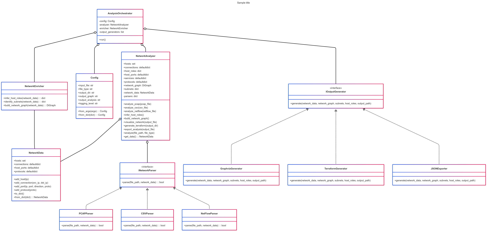

# AutonetGen

Questo progetto analizza dataset di traffico di rete (PCAP, CSV, NetFlow) per inferire:
- Host IP e ruoli (client, server, PLC, ecc.)
- Protocolli utilizzati
- Servizi e mapping delle porte
- Pattern di comunicazione

Genera poi configurazioni Terraform per implementare l'infrastruttura inferita su GCP.

## Architettura del Progetto

L'architettura del progetto segue un design modulare basato sul seguente diagramma delle classi:



Il diagramma mostra la seguente struttura:

- **AnalysisOrchestrator**: Classe principale che coordina l'intero processo
  - Utilizza NetworkAnalyzer per l'analisi
  - Utilizza NetworkEnricher per l'arricchimento dei dati
  - Gestisce i generatori di output

- **NetworkAnalyzer**: Classe per l'analisi del traffico di rete
  - Contiene informazioni su host, connessioni, ruoli, servizi
  - Utilizza parser specializzati per diversi formati di file
  - Costruisce un grafo della rete

- **NetworkEnricher**: Classe per l'arricchimento dei dati con informazioni aggiuntive
  - Inferisce ruoli degli host
  - Identifica subnet

- **Parser**: Gerarchia di classi per l'analisi di diversi formati
  - NetworkParser (Classe base)
    - PCAPParser
    - CSVParser
    - NetFlowParser

- **Generatori di Output**: Gerarchia di classi per la generazione di output
  - OutputGenerator (Coordinatore)
    - GraphvizGenerator (Visualizzazione)
    - TerraformGenerator (Infrastruttura)
    - JSONExporter (Analisi)

## Struttura del Progetto

La struttura del progetto segue un design modulare:

```
network_analyzer/
├── main.py                      # Punto di ingresso principale
├── analysis_orchestrator.py     # Coordinatore dell'analisi
├── network_analyzer.py          # Classe principale per l'analisi
├── network_data.py              # Struttura dati per i dati di rete
├── network_enricher.py          # Arricchimento dei dati
├── output_generator.py          # Coordinatore dei generatori di output
├── config.py                    # Configurazioni e costanti
├── parsers/                     # Moduli per l'analisi dei diversi formati
│   ├── __init__.py
│   ├── base_parser.py           # Classe base per i parser
│   ├── pcap_parser.py           # Parser per file PCAP
│   ├── csv_parser.py            # Parser per file CSV
│   └── netflow_parser.py        # Parser per file NetFlow
└── output_generators/           # Generatori di output
    ├── __init__.py
    ├── base_generator.py        # Classe base per i generatori
    ├── graphviz_generator.py    # Generatore di grafi
    ├── terraform_generator.py   # Generatore di configurazioni Terraform
    └── json_exporter.py         # Esportatore JSON
```

## Installazione

```bash
# Clona il repository
git clone https://github.com/vincenzo426/autonetgen
cd autonetgen

# Installa le dipendenze
pip install -r requirements.txt

# Installa il pacchetto in modalità sviluppo
pip install -e .
```

## Utilizzo

```bash
# Analisi base
python main.py path/to/traffic.pcap

# Specificare il tipo di file
python main.py path/to/traffic.csv --type csv

# Personalizzare le directory di output
python main.py path/to/traffic.pcap --output-dir my_output --output-terraform terraform_configs
```

## Esempi

### Analisi di un file PCAP
```bash
python main.py samples/network_traffic.pcap
```

### Analisi di un file CSV con formato personalizzato
```bash
python main.py samples/traffic_data.csv --type csv
```

### Generazione di output in posizioni specifiche
```bash
python main.py samples/traffic.pcap --output-graph network_diagram.pdf --output-analysis results.json --output-terraform terraform_configs
```

## Personalizzazione

È possibile estendere il progetto implementando nuovi parser o generatori di output:

1. Per aggiungere un nuovo parser, creare una nuova classe che estende `NetworkParser`
2. Per aggiungere un nuovo generatore di output, creare una nuova classe che estende `OutputGenerator`

## Requisiti

- Python 3.6+
- Pacchetti Python elencati in requirements.txt
