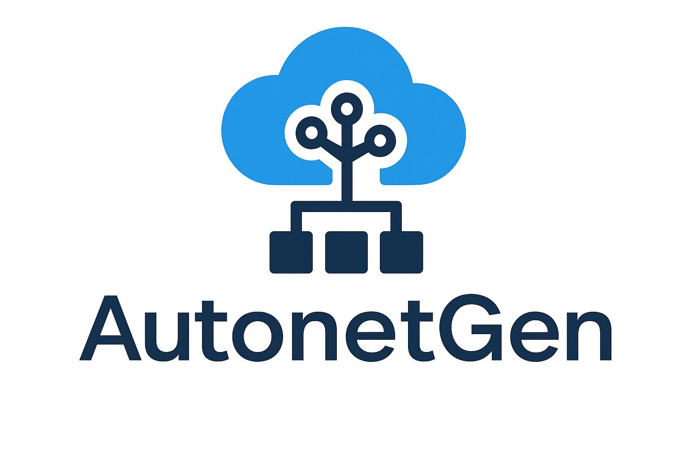
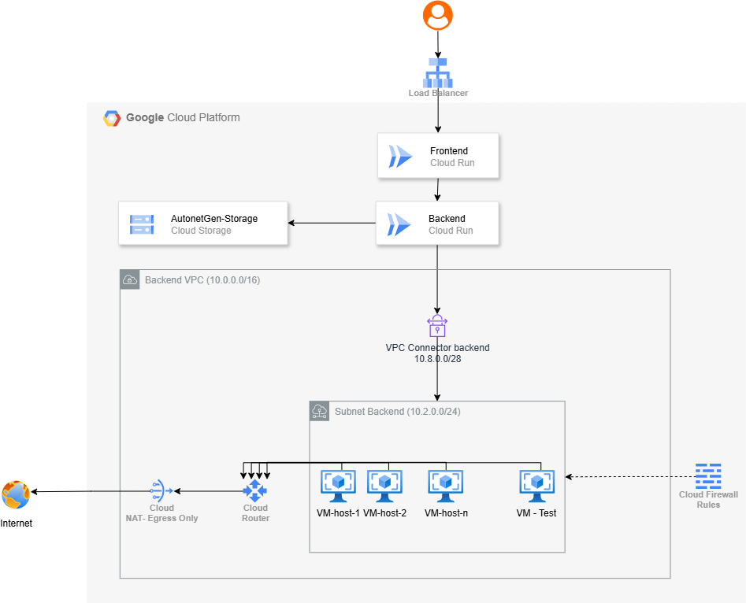
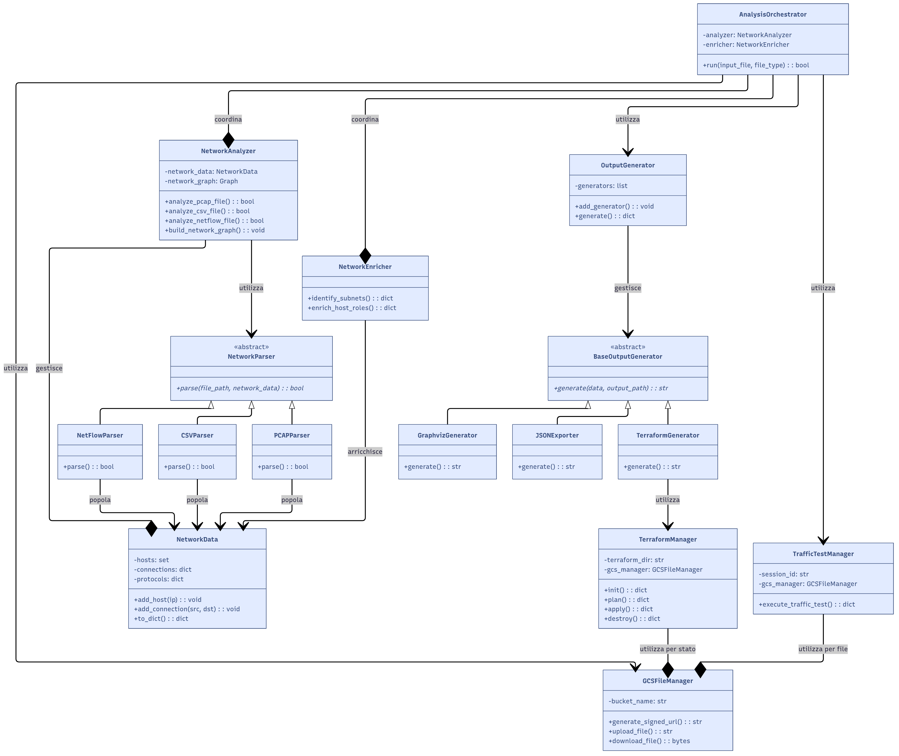

# AutoNetGen - Generatore Automatico di Infrastrutture di Rete



*Piattaforma avanzata per l'analisi automatica del traffico di rete e generazione di infrastrutture cloud*

## 📋 Indice

- [AutoNetGen - Generatore Automatico di Infrastrutture di Rete](#autonetgen---generatore-automatico-di-infrastrutture-di-rete)
  - [📋 Indice](#-indice)
  - [Panoramica del Progetto](#panoramica-del-progetto)
    - [Caratteristiche Principali](#caratteristiche-principali)
  - [Architettura del Sistema](#architettura-del-sistema)
  - [Backend - Componenti Principali](#backend---componenti-principali)
    - [3.1. Network Analyzer](#31-network-analyzer)
      - [Metodi Principali](#metodi-principali)
    - [3.2. Network Enricher](#32-network-enricher)
      - [Metodi Principali](#metodi-principali-1)
    - [3.3. Output Generator](#33-output-generator)
      - [Metodi Principali](#metodi-principali-2)
    - [3.4. Terraform Generator](#34-terraform-generator)
      - [Metodi Principali](#metodi-principali-3)
    - [3.5. Network Parser](#35-network-parser)
      - [Metodi Principali](#metodi-principali-4)
    - [3.6. Analysis Orchestrator](#36-analysis-orchestrator)
      - [Metodi Principali](#metodi-principali-5)
  - [Frontend - Interfacce Principali](#frontend---interfacce-principali)
    - [4.1. Dashboard Principale](#41-dashboard-principale)
      - [Funzionalità Principali](#funzionalità-principali)
    - [4.2. Interfaccia di Upload](#42-interfaccia-di-upload)
      - [Componenti Chiave](#componenti-chiave)
    - [4.3. Configurazione Analisi](#43-configurazione-analisi)
      - [Opzioni di Configurazione](#opzioni-di-configurazione)
    - [4.4. Visualizzazione Risultati](#44-visualizzazione-risultati)
      - [Componenti di Visualizzazione](#componenti-di-visualizzazione)
    - [4.5. Esportazione Dati](#45-esportazione-dati)
      - [Funzionalità di Export](#funzionalità-di-export)
  - [Deploy e Configurazione Cloud](#deploy-e-configurazione-cloud)
    - [5.1. Dockerfile Backend](#51-dockerfile-backend)
      - [Struttura del Dockerfile](#struttura-del-dockerfile)
    - [5.2. Dockerfile Frontend](#52-dockerfile-frontend)
      - [Build Stage](#build-stage)
      - [Production Stage](#production-stage)
    - [5.3. Configurazioni Terraform](#53-configurazioni-terraform)
      - [Struttura dei File Terraform](#struttura-dei-file-terraform)
    - [5.4. Script di Deploy Automatico](#54-script-di-deploy-automatico)
      - [Fasi del Deploy](#fasi-del-deploy)
  - [API e Integrazione](#api-e-integrazione)
    - [Endpoints Principali](#endpoints-principali)
    - [Integrazione Cloud Storage](#integrazione-cloud-storage)

---

## Panoramica del Progetto

**AutoNetGen** è una piattaforma per l'analisi automatica del traffico di rete e la generazione di infrastrutture cloud. Il sistema è progettato per processare file di traffico di rete (PCAP, CSV, NetFlow), analizzare topologie e pattern di comunicazione, e generare automaticamente configurazioni Terraform per il deployment su Google Cloud Platform.

### Caratteristiche Principali

- **Analisi Multi-formato**: Supporto per PCAP, CSV e NetFlow
- **Visualizzazione Intelligente**: Generazione di grafici e configurazioni JSON che descrivono la rete inferita
- **Generazione Automatica**: Creazione di configurazioni Terraform ottimizzate per GCP
- **Architettura Cloud-Native**: Deploy scalabile su Google Cloud Run con archiviazione su Cloud Storage
- **Interface Moderna**: Frontend React responsive con sistema di notifiche in tempo reale

---

## Architettura del Sistema

Il progetto segue un'architettura a microservizi con separazione netta tra backend e frontend:



---

## Backend - Componenti Principali

### 3.1. Network Analyzer

Il **Network Analyzer** è il componente core responsabile dell'analisi del traffico di rete e dell'estrazione di informazioni topologiche.

#### Metodi Principali

**`analyze_file(input_file, file_type=None)`**
- Analizza il file di input determinando automaticamente il formato se non specificato
- Estrae connessioni, protocolli e statistiche di traffico
- Gestisce la conversione dei dati in formato standardizzato per l'elaborazione successiva
### 3.2. Network Enricher

Il **Network Enricher** arricchisce i dati analizzati con informazioni contestuali e inferenze intelligenti.

#### Metodi Principali

**`identify_subnets(network_data)`**
- Analizza gli indirizzi IP per identificare subnet logiche
- Utilizza algoritmi di clustering per raggruppare host correlati
- Determina maschere di subnet ottimali per la segmentazione

**`enrich_host_roles(network_data)`**
- Inferisce i ruoli degli host basandosi su pattern di traffico
- Identifica server web, database, client e servizi specializzati
- Utilizza euristics basate su porte, volumi di traffico e pattern di connessione
### 3.3. Output Generator

L'**Output Generator** è il coordinatore centrale per la generazione di tutti i tipi di output.

#### Metodi Principali

**`add_generator(generator)`**
- Registra un nuovo generatore nel sistema
- Supporta generatori multipli per diversi formati di output
- Mantiene la compatibilità con interfacce standardizzate

**`generate(data, output_paths)`**
- Coordina la generazione di tutti gli output registrati
- Gestisce la distribuzione dei dati ai generatori appropriati
- Monitora il progresso e gestisce gli errori
  
### 3.4. Terraform Generator

Il **Terraform Generator** crea configurazioni Infrastructure as Code per il deployment su Google Cloud Platform.

#### Metodi Principali

**`generate(data, output_dir)`**
- Genera file Terraform completi per l'infrastruttura GCP
- Crea configurazioni per VPC, subnet, firewall e compute instances
- Ottimizza le configurazioni basandosi sui pattern di traffico identificati

### 3.5. Network Parser

Il **Network Parser** gestisce il parsing specifico per ogni formato di file supportato.

#### Metodi Principali

**`parse_pcap(file_path)`**
- Utilizza librerie specializzate (pyshark, scapy) per leggere file PCAP
- Estrae header e payload dei pacchetti
- Ricostruisce sessioni TCP e flussi di comunicazione

**`parse_csv(file_path)`**
- Legge file CSV con formati flessibili per log di rete
- Supporta diverse strutture di colonne comuni
- Normalizza i dati per l'elaborazione uniforme

**`parse_netflow(file_path)`**
- Gestisce record NetFlow v5, v9 e IPFIX
- Estrae statistiche aggregate dai flow records
- Ricostruisce pattern di traffico da dati aggregati

### 3.6. Analysis Orchestrator

L'**Analysis Orchestrator** coordina l'intero processo di analisi e generazione.

#### Metodi Principali

**`run(input_file, file_type, output_dir, output_graph, output_analysis, output_terraform)`**
- Coordina l'esecuzione completa del pipeline di analisi
- Gestisce la sequenza: parsing → analisi → enrichment → generazione output
- Seleziona automaticamente i generatori appropriati basandosi sul tipo di file
---

## Frontend - Interfacce Principali

### 4.1. Dashboard Principale

Il **NetworkAnalyzerDashboard** è il componente root che gestisce lo stato globale dell'applicazione.

#### Funzionalità Principali

**State Management**
- Gestisce lo stato di navigazione tra le schede
- Mantiene informazioni sui file caricati e configurazioni di analisi
- Coordina le comunicazioni con il backend attraverso `apiService`

**Session Management**
- Implementa gestione delle sessioni per upload multipli
- Cleanup automatico dei file temporanei
- Integrazione con Google Cloud Storage per persistenza

**Notification System**
- Sistema di notifiche in tempo reale per feedback utente
- Gestione di stati di caricamento e progresso operazioni
- Alert per errori e conferme di successo

### 4.2. Interfaccia di Upload

Il **UploadTab** fornisce un'interfaccia intuitiva per il caricamento di file di rete.

#### Componenti Chiave

**FileUploader con Drag & Drop**
- Supporto per upload multipli con interfaccia drag-and-drop
- Validazione automatica dei formati supportati (PCAP, CSV, NetFlow)
- Progress bar per upload di file di grandi dimensioni
- Anteprima e gestione dei file caricati

**File Validation**
- Controllo automatico dei formati file
- Validazione delle dimensioni per prevenire overflow
- Feedback immediato sulla compatibilità dei file

### 4.3. Configurazione Analisi

L'**AnalyzeTab** permette la configurazione avanzata dei parametri di analisi.

#### Opzioni di Configurazione

**Parser Selection**
- Selezione automatica o manuale del tipo di parser
- Configurazione specifica per ogni formato supportato
- Anteprima delle opzioni di elaborazione

**Output Format Selection**
- Configurazione dei formati di output desiderati
- Personalizzazione dei percorsi di salvataggio
- Ottimizzazione basata sul tipo di file analizzato

**Adaptive UI**
- L'interfaccia si adatta dinamicamente al tipo di file caricato
- Mostra informazioni specifiche sui generatori utilizzati
- Evidenzia le caratteristiche uniche di ogni modalità di visualizzazione

### 4.4. Visualizzazione Risultati

Il **ResultsTab** presenta i risultati dell'analisi attraverso multiple visualizzazioni.

#### Componenti di Visualizzazione

**NetworkMapView**
- Anteprima della topologia di rete identificata
- Link per aprire visualizzazioni complete
- Supporto per zoom e navigazione interattiva

**ProtocolChartView**
- Grafici a torta della distribuzione dei protocolli
- Statistiche dettagliate per ogni protocollo identificato
- Filtri interattivi per analisi approfondite

**RoleDistributionView**
- Visualizzazione dei ruoli degli host inferiti
- Raggruppamento per tipologie di servizi
- Dettagli sulle caratteristiche di ogni ruolo

**SubnetListView**
- Lista organizzata delle subnet identificate
- Informazioni su CIDR e numero di host per subnet
- Correlazione con ruoli e pattern di traffico

### 4.5. Esportazione Dati

L'**ExportTab** gestisce l'esportazione e il download dei risultati generati.

#### Funzionalità di Export

**Multi-format Export**
- Download di visualizzazioni Graphviz (PDF/PNG)
- Export di configurazioni Terraform complete
- Salvataggio di analisi JSON strutturate

**Cloud Integration**
- Sincronizzazione automatica con Google Cloud Storage
- Gestione di signed URLs per download sicuri
- Archivazione a lungo termine dei risultati

---

## Deploy e Configurazione Cloud

### 5.1. Dockerfile Backend

Il Dockerfile del backend implementa una build multi-stage per ottimizzare le dimensioni dell'immagine e la sicurezza.

#### Struttura del Dockerfile

**Base Image e Dipendenze**
```dockerfile
FROM python:3.9-slim as base
WORKDIR /app
COPY requirements.txt .
RUN pip install --no-cache-dir -r requirements.txt
```

**Production Stage**
- Copia dei file applicativi minimizzando il layer
- Configurazione di un utente non-root per sicurezza
- Esposizione della porta 8080 (standard Cloud Run)
- Health check endpoint per monitoring

**Ottimizzazioni Implementate**
- Multi-stage build per ridurre le dimensioni finali
- Cache layer delle dipendenze per build più veloci
- Installazione di pacchetti system necessari solo per la compilazione
- Cleanup automatico di cache e file temporanei

### 5.2. Dockerfile Frontend

Il Dockerfile del frontend utilizza un approccio multi-stage con build ottimizzata e serving nginx.

#### Build Stage

**Node.js Build Environment**
```dockerfile
FROM node:18 AS build
WORKDIR /app
COPY package.json package-lock.json ./
RUN npm ci
COPY . .
RUN npm run build
```

#### Production Stage

**Nginx Serving**
- Immagine nginx:alpine per dimensioni minime
- Configurazione nginx ottimizzata per SPA React
- Support per variabili d'ambiente runtime
- Health check endpoint per load balancer

**Configurazioni Speciali**
- Script di entrypoint per sostituzione variabili d'ambiente
- Configurazione nginx per routing SPA
- Compression gzip abilitata per performance
- Headers di sicurezza configurati

### 5.3. Configurazioni Terraform

Le configurazioni Terraform sono organizzate in moduli per massimizzare la riusabilità e manutenibilità.

#### Struttura dei File Terraform

**provider.tf**
- Configurazione del provider Google Cloud
- Versioning e requirements del provider
- Configurazione dell'autenticazione

**network.tf**
- VPC network principale con subnet dedicate
- Configurazione di firewall rules granulari
- NAT gateway per connettività outbound
- Load balancer con SSL/TLS termination

**cloud-run.tf**
- Servizi Cloud Run per backend e frontend
- Configurazione di auto-scaling e resource limits
- Service accounts con IAM roles minimali
- Traffic allocation per blue-green deployment

**storage.tf**
- Bucket Cloud Storage per archiviazione file
- Lifecycle policies per gestione automatica
- IAM bindings per accesso controlled
- Versioning e backup configuration

**outputs.tf**
- URLs pubblici per frontend e backend
- Informazioni di rete per debugging
- Comandi utili per gestione post-deployment
- Configurazioni per il backend Terraform generation


### 5.4. Script di Deploy Automatico

Il **deploy.sh** script automatizza l'intero processo di deployment su GCP.

#### Fasi del Deploy

**Prerequisites Check**
- Verifica installazione di gcloud, terraform, docker
- Controllo autenticazione GCP
- Validazione della configurazione terraform.tfvars

**Image Build and Push**
- Build automatico delle immagini Docker
- Push su Google Container Registry
- Tagging con versioni appropriate

**Infrastructure Deployment**
- Inizializzazione e validazione Terraform
- Planning con review interattivo
- Apply con monitoring del progresso

**Post-Deploy Verification**
- Health checks automatici dei servizi
- Verifica delle URL pubbliche
- Test di connettività end-to-end

---

## API e Integrazione

### Endpoints Principali

**`POST /api/analyze`**
- Upload e analisi di file di rete
- Supporto per parametri di configurazione
- Response streaming per file di grandi dimensioni

**`GET /api/health`**
- Health check per load balancer
- Stato delle dipendenze backend
- Informazioni sulla versione dell'applicazione

### Integrazione Cloud Storage

**Signed URLs**
- Generazione sicura di URL temporanei per upload/download
- Gestione automatica delle scadenze
- Audit logging degli accessi

**Session Management**
- Tracking delle sessioni di analisi
- Cleanup automatico dei file temporanei
- Persistenza dei risultati per retrieval futuro
