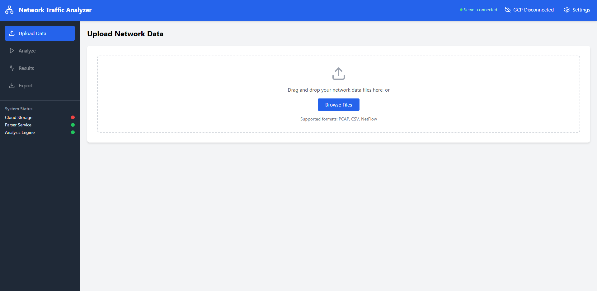

# Network Analyzer GUI
## 📋 Panoramica

Network Analyzer è un'applicazione React che si integra con un backend Python per analizzare file di traffico di rete (PCAP, CSV, NetFlow), visualizzare statistiche, relazioni e topologie di rete, e generare configurazioni Terraform per Google Cloud Platform.

L'interfaccia è progettata con un'architettura modulare che permette un'elevata riutilizzabilità dei componenti e una facile manutenzione.



## 🚀 Funzionalità

- **Upload di file** con supporto drag-and-drop (PCAP, CSV, NetFlow)
- **Configurazione dell'analisi** con diverse opzioni di parser
- **Visualizzazione interattiva** dei risultati dell'analisi:
  - Mappa della rete
  - Distribuzione dei protocolli
  - Ruoli degli host
  - Informazioni sulle subnet
- **Esportazione dei risultati** in vari formati:
  - Visualizzazioni Graphviz
  - Configurazioni Terraform per GCP
  - Analisi JSON
- **Integrazione con Google Cloud** per l'archiviazione dei risultati
- **Sistema di notifiche** per feedback in tempo reale

## 🛠️ Tecnologie utilizzate

- **React**: Framework frontend
- **Tailwind CSS**: Styling dei componenti
- **Lucide React**: Icone moderne
- **SVG**: Visualizzazioni personalizzate (grafici a torta, ecc.)

## 📦 Struttura del progetto

L'applicazione è organizzata in componenti modulari per una migliore manutenibilità e riutilizzabilità:

```
src/
├── App.js                         # Entry point semplificato
├── App.css                        # Stili globali
├── index.js                       # Punto di ingresso React
├── services/
│   └── apiService.js              # Gestione delle chiamate API
└── components/
    ├── NetworkAnalyzerDashboard.js  # Controller principale
    ├── common/                      # Componenti riutilizzabili
    │   ├── FileUploader.js          # Upload di file con drag-and-drop
    │   └── NotificationSystem.js    # Sistema di notifiche
    ├── layout/                      # Componenti di layout
    │   ├── Header.js                # Header dell'app con stato e controlli
    │   └── Sidebar.js               # Barra laterale con navigazione
    ├── tabs/                        # Schede dell'applicazione
    │   ├── UploadTab.js             # Scheda upload file
    │   ├── AnalyzeTab.js            # Scheda configurazione analisi
    │   ├── ResultsTab.js            # Scheda risultati
    │   └── ExportTab.js             # Scheda esportazione
    ├── export/                      # Funzionalità di esportazione
    │   └── ExportOptions.js         # Opzioni per l'esportazione
    └── visualizations/              # Visualizzazioni dati
        ├── ResultsVisualizer.js     # Visualizzatore principale
        ├── NetworkMapView.js        # Mappa della rete
        ├── ProtocolChartView.js     # Distribuzione protocolli
        ├── RoleDistributionView.js  # Distribuzione ruoli host
        └── SubnetListView.js        # Lista subnet
```

## 🚦 Flusso dell'applicazione

1. **Upload**: L'utente carica i file di rete (PCAP, CSV, NetFlow)
2. **Configurazione**: Configura le opzioni di analisi e i formati di output
3. **Analisi**: Avvia l'analisi, che elabora i file tramite il backend Python
4. **Visualizzazione**: Esplora i risultati con grafici e statistiche
5. **Esportazione**: Esporta i risultati nei formati desiderati

## 💻 Installazione e utilizzo

### Prerequisiti

- Node.js (v14 o superiore)
- NPM o Yarn
- Python 3.8+ (per il backend)

### Installazione

1. Clona il repository:
   ```bash
   git clone https://github.com/vincenzo426/autonetgen
   cd network-analyzer-gui
   ```

2. Installa le dipendenze:
   ```bash
   npm install
   # oppure
   yarn install
   ```

3. Avvia l'applicazione in modalità sviluppo:
   ```bash
   npm start
   # oppure
   yarn start
   ```

4. Apri [http://localhost:3000](http://localhost:3000) nel browser

### Connessione con il backend

L'applicazione si connette per default a un backend all'indirizzo `http://localhost:8000`. Per cambiare questa configurazione, modifica la variabile `API_URL` in `src/services/apiService.js`.

```javascript
// src/services/apiService.js
const API_URL = 'http://localhost:8000/api';
```
## 🌐 Integrazione con il backend

L'applicazione comunica con il backend tramite l'API RESTful definita in `apiService.js`. I principali metodi disponibili sono:

- `checkServerStatus()`: Verifica la disponibilità del server
- `analyzeFiles(files, options)`: Invia i file per l'analisi
- `downloadFile(type, filePath)`: Scarica i file generati

## 🔒 Gestione degli errori

L'applicazione include un sistema di notifiche per informare l'utente su:

- Errori di connessione al server
- Problemi durante l'analisi
- Errori di esportazione
- Operazioni completate con successo
